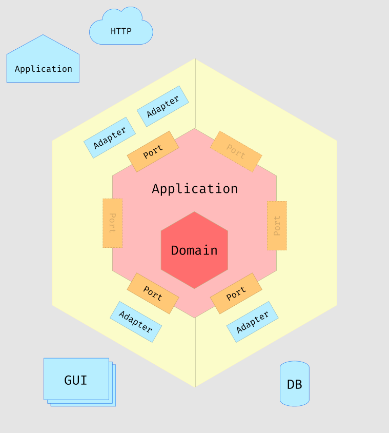

# For Developers

### Authorization Bearer Token

This API needs the Authorization bearer token in order to communicate with arbeidsplassen API.

1. See [pam-public-feed](https://github.com/navikt/pam-public-feed) for documentation and get the public token.
2. Add the token in the Authorization header `Authorization: Bearer TOKEN`

### Docker

Build project: `mvn clean install`

Build Docker: `docker build -t nav/ad-keyword-search .`

Run Docker: `docker run -d -p 8080:8080 nav/ad-keyword-search`

---

# API Documentation

#### GET: /api/ad/weekly-report

> Requires Authorization header `Authorization: Bearer TOKEN`


This returns a weekly report for the past 6 months, starting with the monday before and the current week. 
It will also include weeks that do not have any matching keys.

`localhost:8080/api/ad/weekly-report`

##### Example Curl Request

```bash
curl -s -H 'Authorization: Bearer TOKEN' 'http://localhost:8080/api/ad/weekly-report'
```

##### Example Response

```json
[
  {
    "year": 2022,
    "month": 0,
    "weekNumber": 4,
    "firstDayOfWeek": "2022-01-24",
    "lastDayOfWeek": "2022-01-30",
    "keywordMentions": null
  },
  {
    "year": 2022,
    "month": 0,
    "weekNumber": 5,
    "firstDayOfWeek": "2022-01-31",
    "lastDayOfWeek": "2022-02-06",
    "keywordMentions": {
      "java": 17,
      "kotlin": 4
    }
  },
  {
    "year": 2022,
    "month": 1,
    "weekNumber": 6,
    "firstDayOfWeek": "2022-02-07",
    "lastDayOfWeek": "2022-02-13",
    "keywordMentions": {
      "java": 2
    }
  }
]

```

---

# App based on Hexagonal Architecture

This project is based on a hexagonal architectural pattern. This architectural pattern excels in larger applications, as the
classic layered architecture can become big and make components difficiult to find.




## Adapters

Adapters are the entry and exit components of our service. Nothing enters or leaves our application without going through one of
these. Adapters depends on ports to access our system. This helps reduce coupling, which in turns greatly enhances testability,
maintainability, and flexibility. currently have two adapters:

- in.web
- out.arbeidsplassen

## Application

You can find application config, aop, properties, use cases, and other business related logic here. The Application components
does not depend on any adapters, only on ports.

## Domain

This contains the domain language. These are objects and components that do not contain any outside dependencies. These may
contain independent logic that only speaks the domain language.


---

# Improvements that can be made

- Increase performance by keeping our own data persistence/cache. This would allow us to easily implement pagination in the
  controller.
- Spring Batch would be ideal if we only want our app to process data reports